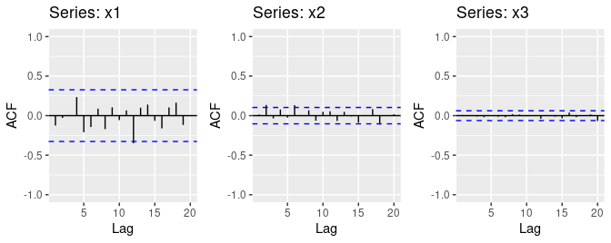

```{r, warning=FALSE, results='hide', echo=FALSE, message=FALSE}
library(fpp2)
library(ggplot2)
library(urca)
```

# Exercise 8.11 - 1
Figure 8.31 shows the ACFs for 36 random numbers, 360 random numbers and 1,000 random numbers.

## a. Explain the differences among these figures. Do they all indicate that the data are white noise?




By looking at the plots, we can see that the ACF spikes at or past the blue lines meaning there is a little white noise.

## b. Why are the critical values at different distances from the mean of zero? Why are the autocorrelations different in each figure when they each refer to white noise?

These blue lines are different in each plot as they are representing the plts 95% confidence interval and are affected by the population size.

\newpage

# Exercise 8.11 - 2
A classic example of a non-stationary series is the daily closing IBM stock price series (data set ibmclose). Use R to plot the daily closing prices for IBM stock and the ACF and PACF. Explain how each plot shows that the series is non-stationary and should be differenced.

```{r}
ggtsdisplay(ibmclose)
```

The plots above show that this data is not stationary as there is some seasonality in the top of chart. As for the ACF, there is a slow decrease with lag remaining over the blue lines. 

\newpage

# Exercise 8.11 - 3
For the following series, find an appropriate Box-Cox transformation and order of differencing in order to obtain stationary data.

## a. `usnetelec` 
```{r}
autoplot(usnetelec)
```


```{r}
ur.kpss(usnetelec) %>% summary()
ndiffs(ibmclose)
usnetelec %>% diff() %>% autoplot()
```

There is 1 order of differencing required.

## b. `usgdp`
```{r}
autoplot(usgdp)
ur.kpss(usgdp) %>% summary()
```
```{r}
ndiffs(usgdp)
nsdiffs(usgdp)
autoplot(diff(diff(usgdp)))
```

There is no adjustment necessary.

## c. `mcopper`

```{r}
autoplot(mcopper)
ur.kpss(mcopper) %>% summary()
```

```{r}
ndiffs(mcopper)
autoplot(diff(mcopper))
```

We'll transform the `mcopper` data.
```{r}
mcopper_lambda <- BoxCox.lambda(mcopper)
mcopper %>% BoxCox(mcopper_lambda) %>% diff() %>% autoplot()
```

## d. `enplanements`

```{r}
autoplot(enplanements)
ur.kpss(enplanements) %>% summary()
ndiffs(enplanements)
nsdiffs(enplanements)
```


With this data, we're going to want to remove seasonality and also make it stationary. We can do this by applying the `diff()` function twice.
```{r}
enp_lambda <- BoxCox.lambda(enplanements)
enplanements %>% BoxCox(enp_lambda) %>% diff() %>% diff() %>% autoplot()
```


## e. `visitors`
```{r}
autoplot(visitors)
ur.kpss(visitors) %>% summary()
```
```{r}
ndiffs(visitors)
nsdiffs(visitors)
```

We'll look to take the same approach here that we did with the `enplanments` data.

```{r}
vis_lambda <- BoxCox.lambda(visitors)
visitors %>% BoxCox(vis_lambda) %>% diff() %>% diff() %>% autoplot()
```

\newpage

# Exercise 8.11 - 5
For your retail data (from Exercise 3 in Section 2.10), find the appropriate order of differencing (after transformation if necessary) to obtain stationary data.

```{r}
retaildata <- readxl::read_excel("retail.xlsx", skip=1)

myts <- ts(retaildata[,"A3349414R"],
  frequency=12, start=c(1982,4))

autoplot(myts)
```

```{r}
ur.kpss(myts) %>% summary()
```

```{r}
myts_lambda <- BoxCox.lambda(myts)
myts %>% BoxCox(lambda = myts_lambda) %>% ndiffs()
myts %>% BoxCox(lambda = myts_lambda) %>% nsdiffs()
```

```{r}
myts %>% BoxCox(myts_lambda) %>% diff() %>% diff() %>% autoplot()
```


\newpage

# Exercise 8.11 - 6
Use R to simulate and plot some data from simple ARIMA models.

# a. Use the following R code to generate data from an AR(1) model with ϕ1 = 0.6 and σ2 = 1. The process starts with y1 = 0.

```{r}
y <- ts(numeric(100))
e <- rnorm(100)
for(i in 2:100)
  y[i] <- 0.6*y[i-1] + e[i]
```


# b. Produce a time plot for the series. How does the plot change as you change ϕ1?

```{r}
autoplot(y)
```

```{r, fig.width= 10, fig.height= 8}
y <- ts(numeric(100))
y2 <- ts(numeric(100))
y3 <- ts(numeric(100))
y4 <- ts(numeric(100))
e <- rnorm(100)
for(i in 2:100){
  y[i] <- 0.6*y[i-1] + e[i]
  y2[i] <- 0.1*y2[i-1] + e[i]
  y3[i] <- 0.8*y3[i-1] + e[i]
  y4[i] <- 1*y4[i-1] + e[i]
}
gridExtra::grid.arrange(
  autoplot(y2) + ggtitle("phi = 0.1"),
  autoplot(y) + ggtitle("phi = 0.6"),
  autoplot(y3) + ggtitle("phi = 0.8"),
  autoplot(y4) + ggtitle("phi = 1"), nrow = 2
)
```

As ϕ1 gets smaller, we see the plots become stationary, where when it gets bigger, we see the plot become non-stationary.


## c. Write your own code to generate data from an MA(1) model with θ1 = 0.6 and σ2 = 1.

```{r}
y_ma1 <- ts(numeric(100))
e <- rnorm(100)
for(i in 2:100)
  y_ma1[i] <- 0.6*e[i-1] + e[i]
```


## d. Produce a time plot for the series. How does the plot change as you change θ1?

```{r}
autoplot(y_ma1)
```

```{r, fig.width= 10, fig.height= 8}
y_ma1 <- ts(numeric(100))
y2_ma1 <- ts(numeric(100))
y3_ma1 <- ts(numeric(100))
y4_ma1 <- ts(numeric(100))
e <- rnorm(100)
for(i in 2:100){
  y_ma1[i] <- 0.6*e[i-1] + e[i]
  y2_ma1[i] <- 0.1*e[i-1] + e[i]
  y3_ma1[i] <- 0.8*e[i-1] + e[i]
  y4_ma1[i] <- 1*e[i-1] + e[i]
}
gridExtra::grid.arrange(
  autoplot(y2_ma1) + ggtitle("phi = 0.1"),
  autoplot(y_ma1) + ggtitle("phi = 0.6"),
  autoplot(y3_ma1) + ggtitle("phi = 0.8"),
  autoplot(y4_ma1) + ggtitle("phi = 1"), nrow = 2
)
```

We see the plots remain stationary regardless of a change in θ1.

## e. Generate data from an ARMA(1,1) model with ϕ1 = 0.6, θ1 = 0.6 and σ2 = 1.

```{r}
y_ARMA <- ts(numeric(100))
e <- rnorm(100)
for(i in 2:100)
  y_ARMA[i] <- 0.6*y_ARMA[i-1] + 0.6*e[i-1] + e[i]
```

## f. Generate data from an AR(2) model with ϕ1 = −0.8, ϕ2 = 0.3 and σ2 = 1. (Note that these parameters will give a non-stationary series.)

```{r}
y_AR2 <- ts(numeric(100))
e <- rnorm(100)
for(i in 3:100)
  y_AR2[i] <- (-0.8*y_AR2[i-1]) + (0.3*y_AR2[i-2]) + e[i]
```

## g.Graph the latter two series and compare them.

```{r, fig.width=10, fig.height=8}
gridExtra::grid.arrange(autoplot(y_ARMA) + ggtitle("ARMA"), autoplot(y_AR2) + ggtitle("AR(2)"))
```


\newpage

# Exercise 8.11 - 7
Consider `wmurders`, the number of women murdered each year (per 100,000 standard population) in the United States.

## a. By studying appropriate graphs of the series in R, find an appropriate ARIMA(p,d,q) model for these data.

```{r}
autoplot(wmurders)
ndiffs(wmurders)
wm_lambda <- BoxCox.lambda(wmurders)
wmurders %>% BoxCox(wm_lambda) %>% diff() %>% diff()  %>% ggtsdisplay()
```

```{r}
wm_fit <- Arima(wmurders, order = c(1,2,1)) 
summary(wm_fit)
```

## b. Should you include a constant in the model? Explain.

In the chapter, it stated that we should not include a constant if the d = 2, so we will not include a constant here.

## c. Write this model in terms of the backshift operator.

$$
(1 - B)^{2} y_{t}
$$

## d. Fit the model using R and examine the residuals. Is the model satisfactory?

```{r}
checkresiduals(wm_fit)
```


This model is satisfactory because we see all autocorrelations within the blue lines showing that the residuals are acting like the white noise.

## e. Forecast three times ahead. Check your forecasts by hand to make sure that you know how they have been calculated.

```{r}
forecast(wm_fit, h=3)
```

## f. Create a plot of the series with forecasts and prediction intervals for the next three periods shown.

```{r}
autoplot(forecast(wm_fit, h=3), PI = T)
```


## g. Does auto.arima() give the same model you have chosen? If not, which model do you think is better?

```{r}
wm_fit2 <- auto.arima(wmurders)
summary(wm_fit2)
```


The `auto.arima()` function does give us the same model.